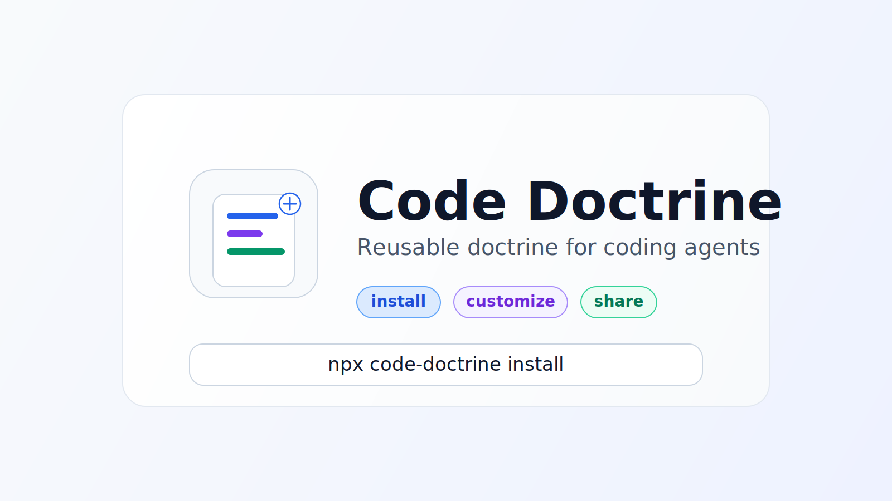

# code-doctrine

<picture>
  <source media="(prefers-color-scheme: dark)" srcset="./code-doctrine-hero.svg">
  <source media="(prefers-color-scheme: light)" srcset="./code-doctrine-hero-light.svg">
  
</picture>

CLI package manager for reusable code doctrine packages.

## What it does

`code-doctrine` is the shared client for the Code Doctrine ecosystem.

It lets you:

- resolve doctrine packages from npm or GitHub
- install them into OpenCode or Pi
- fork a doctrine into a local working directory
- customize a doctrine locally before publishing anything
- inspect doctrine metadata from npm, GitHub, or local files

Developer doctrine repos should stay plain doctrine packages.
This CLI owns installation and environment wiring.

## Quick start

Install Kamil Chmielewski's doctrine into an OpenCode project:

```bash
npx code-doctrine install kamilchm opencode --project
```

Install it for Pi:

```bash
npx code-doctrine install kamilchm pi
```

## Local development workflow

You do not need to publish a doctrine before trying your own changes.

A typical local loop looks like this:

```bash
npx code-doctrine fork kamilchm ./my-doctrine
# edit files inside ./my-doctrine
npx code-doctrine install ./my-doctrine opencode --project
```

You can also clone or fork a doctrine repo yourself and install it directly from the working tree:

```bash
npx code-doctrine install ./path-to-your-local-doctrine pi --project
```

This is the intended workflow for customization:

1. find a doctrine you like
2. fork or clone it locally
3. change the doctrine files under `skill/`
4. adjust root integration metadata such as `AGENTS-section.md` if needed
5. reinstall from local files until it behaves the way you want
6. publish it later only if you want to share it

## Resolution strategy

For `code-doctrine install <author> ...`, the client resolves in this order:

1. npm package `@<author>/code-doctrine`
2. GitHub fallback `github:<author>/code-doctrine`
3. local doctrine directory path such as `./my-doctrine`

So for `kamilchm`, the client tries:

- `@kamilchm/code-doctrine`
- then `github:kamilchm/code-doctrine`

## Commands

```bash
npx code-doctrine install <author|path> [opencode|pi|all] [...flags]
npx code-doctrine resolve <author|path>
npx code-doctrine info <author|path>
npx code-doctrine fork <author|path> [dest-dir] [--force]
npx code-doctrine search
npx code-doctrine doctor [author|path]
npx code-doctrine spec
```

## Doctrine package layout

A doctrine package should contain:

- a dedicated `skill/` directory with all installable doctrine files
- `AGENTS-section.md` at the repo root for CLI integration into target `AGENTS.md`
- `doctrine.json`
- root package metadata for publish and documentation

It should not contain harness-specific installer logic.
That separation keeps doctrine packages easy to edit locally and easy to reuse.

## Standard

The package convention is documented in:

- [`STANDARD.md`](./STANDARD.md)

## Current recommended package

For Kamil Chmielewski's public implementation:

- `@kamilchm/code-doctrine`
- <https://github.com/kamilchm/code-doctrine>

## Publishing

This repo publishes to npm through GitHub Actions OIDC trusted publishing.
No `NPM_TOKEN` secret is required.

## License

MIT
